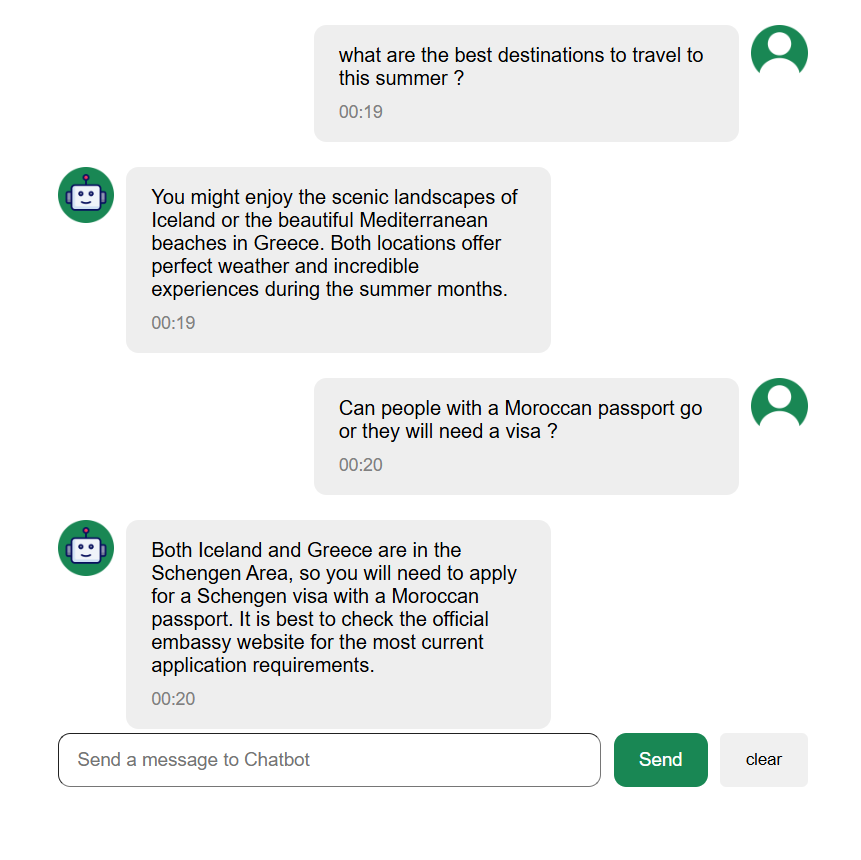

# AI_Chatbot

A conversational AI chatbot built with React and Express, powered by Google's Gemini API. It remembers the conversation, so you can ask natural follow-up questions.

## Features

- Conversational memory — understands follow-up questions in context
- Real-time AI responses via the Gemini API
- Loading indicator while the bot is thinking
- Graceful error handling
- Secure API key handling (kept server-side, never exposed to the browser)

## Tech Stack

- **Frontend:** React, Vite
- **Backend:** Node.js, Express
- **AI:** Google Gemini API

## How It Works

The React frontend sends the conversation to an Express backend, which forwards it to the Gemini API and returns the reply. The API key lives only on the server, so it's never exposed in the browser. The full message history is sent with each request, which is what gives the bot its memory.

## Running Locally

**Backend**
\`\`\`bash
cd chatbot-backend
npm install
# create a .env file with: GEMINI_API_KEY=your_key_here
node server.js
\`\`\`

**Frontend**
\`\`\`bash
cd chatbot-frontend
npm install
npm run dev
\`\`\`

You'll need your own free Gemini API key from [Google AI Studio](https://aistudio.google.com).
